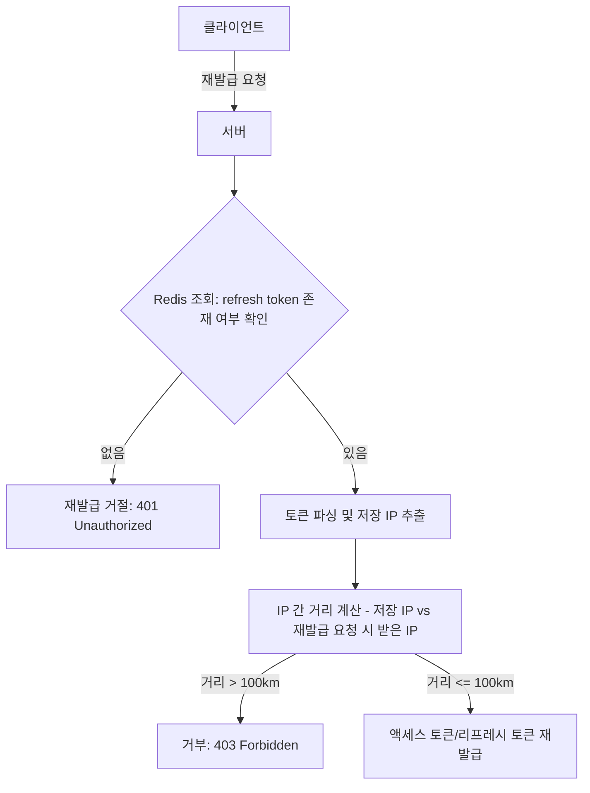

# 위치 기반 jwt 인증 / 인가

AT 에 들어가는 값 
{
"userId", 
"email"
}

RT 에 들어가는 값 {"ip"}

**AT 만료 시**

```mermaid
graph TD
A[클라이언트] -->|재발급 요청| B[서버]
B --> C{Redis 조회: refresh token 존재 여부 확인}
C -->|없음| D[재발급 거절: 401 Unauthorized]
C -->|있음| E[토큰 파싱 및 저장 IP 추출]
E --> F[IP 간 거리 계산 - 저장 IP vs 재발급 요청 시 받은 IP]
F -->|거리 > 100km| H[거부: 403 Forbidden]
F -->|거리 <= 100km| I[액세스 토큰/리프레시 토큰 재발급]
```
